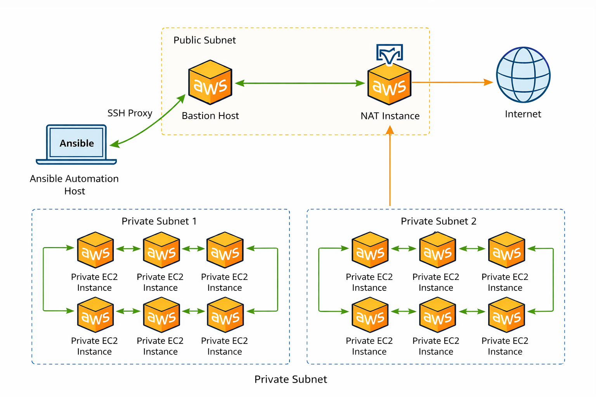
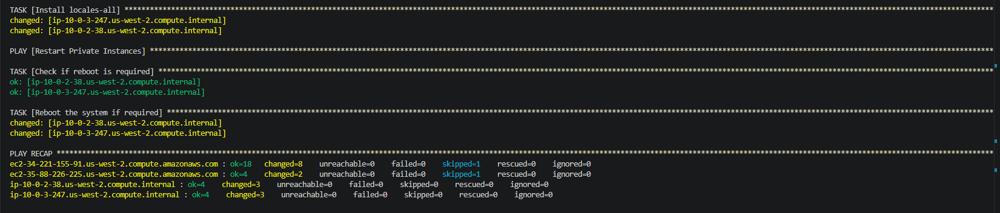
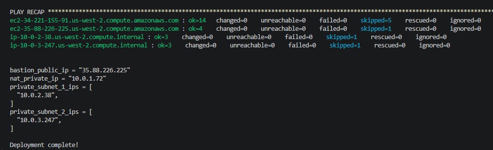
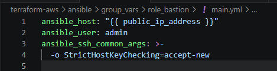
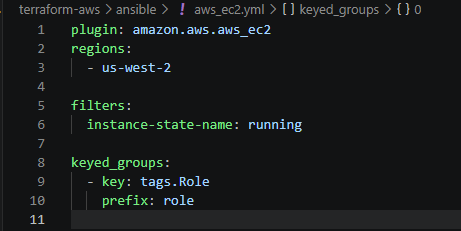
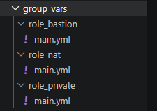
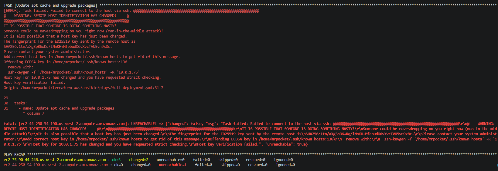
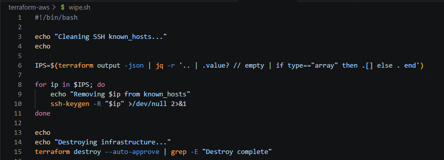
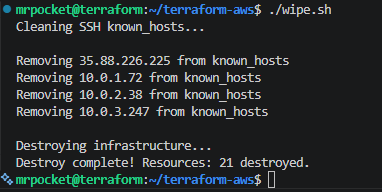

# AWS Terraform Automation with Ansible Configuration

## Overview

This project provisions a complete AWS networking and compute environment using Terraform and configures instances using Ansible. The architecture includes a custom VPC with public and private subnets, a bastion host for secure access, and a NAT instance to provide outbound internet access for private instances. Terraform is used to build the infrastructure, while Ansible is used to configure and manage the instances after deployment.

## Architecture



The environment is deployed inside a custom VPC and is split across public and private subnets. This project uses the same architecture as a previous [ansible project](https://github.com/umraffer32/ansible/blob/main/README.md). The difference comes from the automatic deployment of the AWS infrastructure as opposed to using an existing resources.

- **Public Subnet**
  - Bastion host (SSH access point)
  - NAT instance (provides outbound internet for private instances)

- **Private Subnets**
  - EC2 instances with no public IPs
  - Outbound internet access routed through NAT instance

- **Access Flow**
  - User → Bastion Host → Private Instances
  - Private Instances → NAT → Internet

## How It Works

1. Terraform provisions the AWS infrastructure, including the VPC, subnets, security groups, and EC2 instances.
2. Once infrastructure is created, the deploy script executes Ansible.
3. Ansible uses the AWS dynamic inventory plugin to discover instances based on tags.
4. The bastion host is used as a jump host (ProxyCommand) to access private instances securely.
5. The NAT instance is configured to allow outbound internet access for private instances.
6. Ansible applies configuration tasks such as system updates and package installation.
7. The environment is fully automated and can be destroyed and recreated on demand.

## Deployment

### Prerequisites

- AWS account
- AWS CLI configured
- Terraform installed
- Ansible installed

First, clone the repository. Visit the [terraform.example.tfvars](https://github.com/umraffer32/terraform-aws/blob/main/terraform.example.tfvars) file to configure variables needed for deployment. Launch deployment and teardown scripts once variables have been set.

### Steps

```bash
# Clone the repository
git clone https://github.com/umraffer32/terraform-aws.git
cd terraform-aws
```

```bash
# Deploy infrastructure and configure instances
./deploy.sh
```

```bash
# Clean SSH keys - Destroy infrastructure when finished
./wipe.sh
```

## Key Concepts Demonstrated

- Infrastructure as Code (Terraform)
- Configuration Management (Ansible)
- AWS VPC Networking (Public vs Private Subnets)
- Bastion Host Architecture
- NAT Instance for Private Subnet Internet Access
- SSH ProxyCommand for Secure Access
- Dynamic Inventory with AWS EC2 Plugin
- Idempotent Configuration Management

  
  

## Problems & Fixes

- **SSH access to bastion using public IP**  
  Fixed by explicity commanding ansible to use bastion's public IP and not DNS.  

- **Ansible user mismatch caused SSH permission denied errors**  
  Fixed by explicitly setting the correct remote user for bastion and private hosts.

  

- **Group variable loading was inconsistent**  
  Fixed by aligning `group_vars` naming with Ansible inventory group names.

  


- **SSH host key errors from duplicate IPs in the known_hosts file.**
This was solved with the creation of a tear down script which dynamically cleans the IPs outputted from the deployment.

  
  
  

## Future Improvements

- Replace NAT instance with NAT Gateway for managed high availability
- Implement Application Load Balancer (ALB)
- Add Auto Scaling Group for dynamic instance scaling
- Introduce RDS for a highly available database layer
- Expand to a multi-AZ architecture using Terraform VPC module
- Add monitoring and alerting with CloudWatch
- Implement HTTPS using ACM and a custom domain